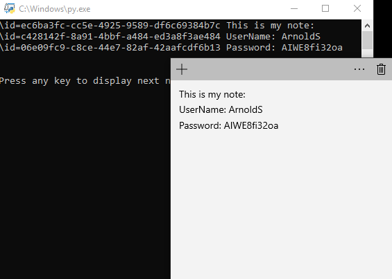

# Win10-Dump-StickyNotes
Dump sticky notes content with python script

> Note: This was tested on windows 10 Build 18363

### How does it work? 
`Microsoft.Notes.exe` use sqlite db to store the notes. You can see the handle in ProcessExplorer. 
Reading it is as simple as `SELECT * FROM Note` table, and viewing the content. 
This is what the script does.

### Usages
* Backup stickynote contents.
* Extend this code to change programaticly basicly anything about the notes. (For ex. Set a specifiy layout for the notes / Light with color notes that contain a string.. Etc). Use as a refernce the [Tables.pdf](./Tables.pdf) file in this repo. 

### How to run?
Download the `.py` file, and run.

